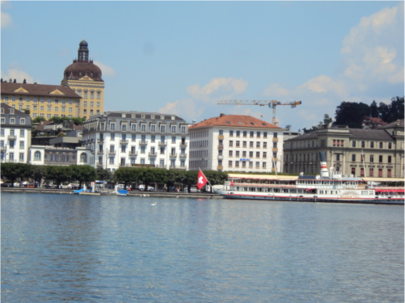

# Panoramic Image Stitching Techniques

This project is dedicated to the exploration of techniques for stitching panoramic images, employing two primary methodologies: traditional image stitching and deep learning-based approaches.

## Traditional Image Stitching

The traditional method for creating panoramic images in this project encompasses a series of well-established steps:

- **Corner Detection**: Identifying interest points within the images that can be used for stitching.
- **Adaptive Non-Maximal Suppression (ANMS)**: Reducing the number of interest points to those most suitable for stitching, thereby improving processing efficiency.
- **Feature Descriptor Extraction**: Creating unique descriptors for each interest point, facilitating their matching across images.
- **Feature Matching**: Associating interest points from different images based on their descriptors.
- **RANSAC for Homography Estimation**: Employing the RANSAC algorithm to robustly estimate the homography matrix, enabling accurate alignment of images.

## Deep Learning Approaches

In addition to traditional techniques, this project explores the application of Deep Learning for panoramic image stitching, focusing on both supervised and unsupervised learning paradigms. A key component of this investigation is the implementation of HomographyNet, a neural network designed to estimate the homography matrix between pairs of images.

## Image Samples

Below are sample images used in this project, along with the resulting stitched panoramic image using the traditional process.

**First Image:**

**Second Image:**

**Third Image:**

**Resulting Panoramic Image After Traditional Processing:**

