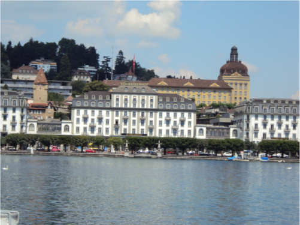

# Panoramic_Images

This repository offers a comprehensive exploration of panorama image stitching, showcasing two distinct methodologies. The first approach adheres to traditional image stitching techniques, encompassing corner detection, Adaptive Non-Maximal Suppression (ANMS), feature descriptor extraction, feature matching, and RANSAC for homography estimation. The second approach delves into the realm of Deep Learning, investigating both supervised and unsupervised strategies, notably through the implementation of HomographyNet. 
First Image:

Second Image:

Third Image:

After Implementation of Traditional Processes:

